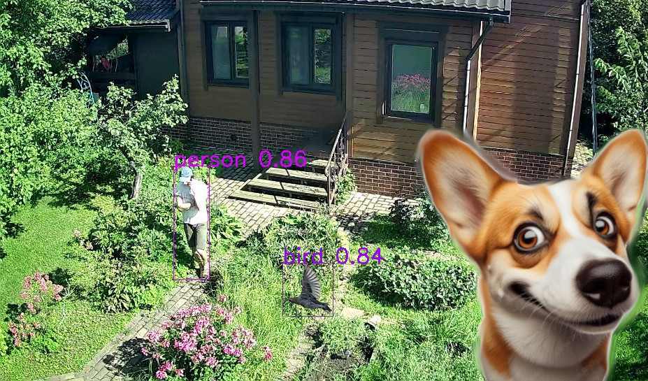

<p align="center">
  <h1 align="center">The Watchdog Never Sleeps! </h1>
  <p align="center">
    <a href="https://www.linkedin.com/in/anton-gudym-829772233/">Anton Gudym</a>
  </p>
</p>
<p align="center">
    
    <br>
    Light-weight framework for Objects AI-detection with Live-Cameras (USB/IP) and Telegram-bot notifications. Use Yolo or adjust for you own AI-models support and catch the best shot!
</p>

## Installation

Installation for Linux, Win or Mac is similar. Jetson TX1/2 (Ubuntu18/Arm/Python3.6) works too! The three main steps are below:

&nbsp;1. Download the watchdog and install required python-modules (linux-shell command):
```shell
cd /home/user
git clone https://github.com/agudym/watchdog.git
cd watchdog
python -m pip install -r requirements.txt
```

&nbsp;2. Get AI-detector and weights/configuration, YOLOv9 (2024) is supported at the moment. Or simply adjust `detector.py` for your model.
<br>
&nbsp;[Optional] For GPU(Nvidia CUDA) accelerated detection with Torch follow <a href="https://pytorch.org/get-started/locally">instructions</a>.
```shell
cd ..
git clone https://github.com/WongKinYiu/yolov9.git
cd yolov9
wget https://github.com/WongKinYiu/yolov9/releases/download/v0.1/yolov9-m-converted.pt
```
&nbsp;Add 2 new paths to `config.json` (see below an example). Then run `python -m watchdog.detector config.json <path to test image dir>` to verify that detection works.

&nbsp;3. [Optional] Register your watchdog-bot in Telegram: basically, send <a href="https://telegram.me/BotFather">@BotFather</a> the command `/newbot` to get token-string (keep it SECRET!).
<br>
&nbsp;&nbsp;&nbsp;3.1. Start conversation with your new bot in Telegram (it won't respond so far, though).
<br>
&nbsp;&nbsp;&nbsp;3.2. Copy-paste the token to the configuration file `config.json`.
<br>
&nbsp;&nbsp;&nbsp;3.3. Run `python -m watchdog.bot configs/config.json` to initialize chat-id in the config.
<br>
Alright, the environment is set!

## Cameras configration
Last but not least is to **configure the cameras**. USB or IP, one or many - doesn't matter. First of all it's recommended to use <a href="https://www.videolan.org/vlc/">VLC</a> to check the camera (ip-connection). Then fill the missing fields in `configs/config.json`.
<br>
Below is the complete example. Follow the descriptions there to setup your own configuration and run `python -m watchdog.camera configs/config.json` to make sure that images are captured correctly.

## Start
When the missing fields from `configs/config.json` are filled, run the Watchdog by executing the main script, e.g.:
```shell
cd /home/user/watchdog
python -m watchdog.main configs/config.json
```
Or, for example, run a detached process via temporary ssh-connection (linux-shell command):
```shell
nohup python -m watchdog.main configs/config.json &> log_nohup.txt &
```
That's it! Now watchdog will record activity and Telegram-bot will speak and report!
<br>
To interrupt the watchdog-process - create an empty file with the name `stop` in the `output_path`, e.g. (linux-shell command):
```shell
touch /home/user/recordings/stop
```

## Configration example
```json
// Comments must be removed before use!
{
    "version": "0.1.0",
    "Watchdog":
    {
        // Output LOCAL directory with recorded images and logs
        "output_path" : "/home/user/recordings",
        // Each camera save jpg images with given frequency (even if nothing is detected), in seconds
        "img_log_timeout" : 300,
        // Log everything to the file
        "verbose" : true
    },
    "Detector" :
    {
        "Init" :
        {
            // Path to the Yolo library (current version doesn't support installation)
            "yolo_lib_path" : "/home/user/yolov9",
            // Path to the model weights
            "checkpoint_path" : "/home/user/yolov9/yolov9-m-converted.pt",
            // Resolution used for faster inference, so far it's (1920, 1080) * k, k = 1024 / 1920. Adjust if cameras have another aspect (padding might be needed, e.g. w/h mod 32 == 0)
            "img_width_height_channels" : [1024, 576, 3],
            // Processing unit: auto, cpu, cuda
            "device_switch" : "auto",
            // Switch to lighter (fp32 -> fp16) computations (if possible)
            "is_model_fp16" : false
        },
        // All detectable classes/object categories (comma-separated), e.g. for Yolo it's 80 categories from COCO 2017 dataset http://cocodataset.org
        "categories_all" : "person,bicycle,car,motorcycle,airplane,bus,train,truck,boat,traffic light,fire hydrant,stop sign,parking meter,bench,bird,cat,dog,horse,sheep,cow,elephant,bear,zebra,giraffe,backpack,umbrella,handbag,tie,suitcase,frisbee,skis,snowboard,sports ball,kite,baseball bat,baseball glove,skateboard,surfboard,tennis racket,bottle,wine glass,cup,fork,knife,spoon,bowl,banana,apple,sandwich,orange,broccoli,carrot,hot dog,pizza,donut,cake,chair,couch,potted plant,bed,dining table,toilet,tv,laptop,mouse,remote,keyboard,cell phone,microwave,oven,toaster,sink,refrigerator,book,clock,vase,scissors,teddy bear,hair drier,toothbrush",
        // Categories for notifications (images with the objects saved asap on the disk and send via bot)
        "categories_notify" : "person,bird,cat,dog",
        // How confident the detector must be to signal/alarm with the bot, 0 < confidence_threshold < 1
        "confidence_threshold" : 0.8,
        // Merge close bounding boxes represented with normalized 4-vector (x_low, y_low, x_high, y_high) in [0,1]^4
        "bbox_merge_dist" : 0.01
    },
    "Bot" :
    {
        // How often the watchdog can bother via Telegram
        "bot_warning_timeout" : 30,
        // The SECRET! token received from the @BotFather
        "token" : "1234567890:AaBbCcDdEeFfGg123AaBbCcDdEeFfGg",
        // Your bot-chat identifier (aquired from bot.py)
        "chat_id" : "987654321"
    },
    "Cameras":
    [
        // Main camera setting, it's address in the system/network (supported by OpenCV's cv::VideoCapture):
        // 1. USB camera integer-index, e.g. integer 0 or "/dev/video0"
        // 2. RTSP address, e.g. "rtsp://192.168.1.101"
        // 3. GStreamer pipeline
        // 4. OR! PATH to an existing DIRECTORY with Images (Good for debugging)
        {
            // USB camera
            "uri": 0,
            // Camera alias for logging, e.g. "cam1", "cam_home", "cam_street"
            "name": "usb0",
            // Number of frames per second (for data-polling and cpu-resource preservation)
            "fps": 30.0,
            // Initialize, capture, release time limit in seconds (before reset)
            "timeout_err": 30,
            // Number of failed frames before reset
            "count_err" : 100
        },
        {
            // The most universal approach for IP cameras supporting RTSP
            "uri": "rtsp://192.168.1.101",
            "name": "ip1",
            "fps": 15.0,
            "timeout_err": 30,
            "count_err" : 100
        },
        {
            // Manually set GStreamer-pipeline for "older" camera with h264 stream for Jetson TX1/2 (hardware decoding without buffering)
            "uri": "rtspsrc location=rtsp://192.168.1.101 ! rtph264depay ! nvv4l2decoder ! nvvidconv ! video/x-raw, width=(int)1920, height=(int)1080, format=(string)BGRx ! videoconvert ! appsink max-buffers=1 drop=True",
            "name": "ip2_h264",
            "fps": 25.0,
            "timeout_err": 30,
            "count_err" : 100
        },
        {
            // Manually set GStreamer-pipeline for h265 stream for Jetson TX1/2
            "uri": "rtspsrc location=rtsp://192.168.1.102 ! rtph265depay ! decodebin ! nvvidconv ! video/x-raw, width=(int)1920, height=(int)1080, format=(string)BGRx ! videoconvert ! appsink max-buffers=1 drop=True",
            "name": "ip2_h265",
            "fps": 25.0,
            "timeout_err": 30,
            "count_err" : 100
        }
        // more cams go here ...
    ]
}
```
## Notes
Setting up hardware-accelerated decoding could be tricky but necessary to **avoid lags or delays** during streams processing. Use `gstreamer` application to find the right pipeline, e.g. linux-shell command (for Jetson TX1/2):
```shell
gst-launch-1.0 rtspsrc location=rtsp://192.168.1.101 ! rtph264depay ! nvv4l2decoder ! nvvidconv ! video/x-raw, 'width=(int)1920, height=(int)1080, format=(string)BGRx' ! videoconvert ! nv3dsink max-buffers=1 drop=True
```
Also specific build of OpenCV with GStreamer support might be required. For Jetson TX1/2 follow <a href="https://gist.github.com/mtc-20/c1f324f70fad774ca6f381c07cb3f19a">instructions</a>.
## License

The library and it's sources are released under the [MIT License](./LICENSE).
